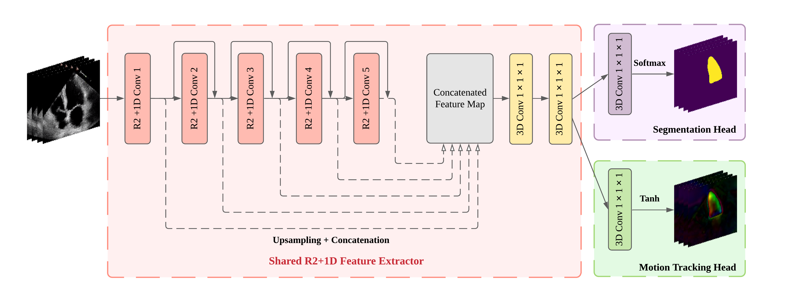

# Fully Automated Video Segmentation and Motion Tracking

The code in this repository is an implementation of CLAS-FV framework described in the paper, "[Fully automated multi-heartbeat echocardiography video segmentation and motion tracking](http://eg.bucknell.edu/~jvs008/research/cardiac/SPIE22/chenSPIE22_preprint.pdf)," SPIE Medical Imaging 2022.

## Content

motion_segment.py: The main script for segmenting an echocardiography video with or without fusion augmentation.  
Example usage: `python motion_segment.py -p <path to the ultrasound video file> -d cuda -c all`  
echonet_r2plus1d_notebooks: Notebooks for training and validating our CLAS-FV framework  
src: Source codes

## Citation

If you use our code in your work or you find it useful, please cite the article below (or see our [bibtex](citations.bib)):

Chen, Yida, Xiaoyan Zhang, Christopher M. Haggerty, and Joshua V. Stough. "Fully automated multi-heartbeat echocardiography video segmentation and motion tracking." In Medical Imaging 2022: Image Processing. International Society for Optics and Photonics, 2022.

Chen, Yida, Xiaoyan Zhang, Christopher M. Haggerty, and Joshua V. Stough. "Assessing the generalizability of temporally coherent echocardiography video segmentation." In Medical Imaging 2021: Image Processing, vol. 11596, p. 115961O. International Society for Optics and Photonics, 2021.

## License & Disclaimer

The project is released under the MIT license. The code has not been tested for any medical applications.